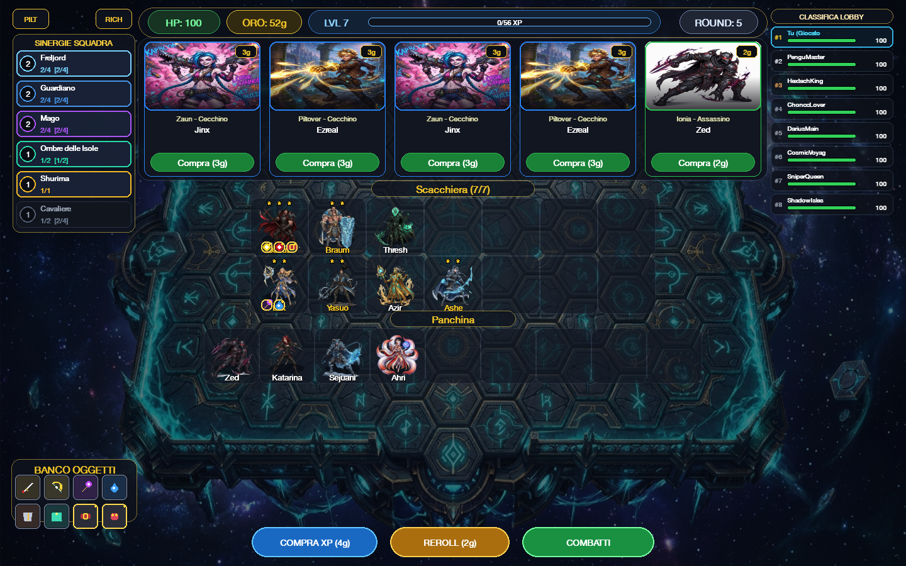
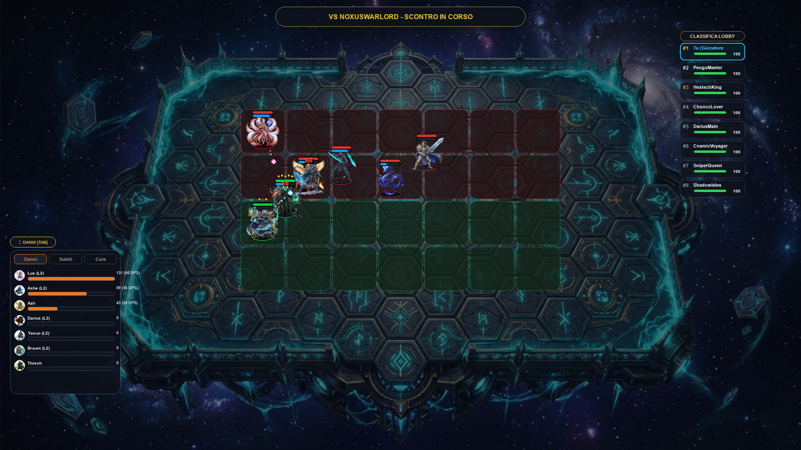
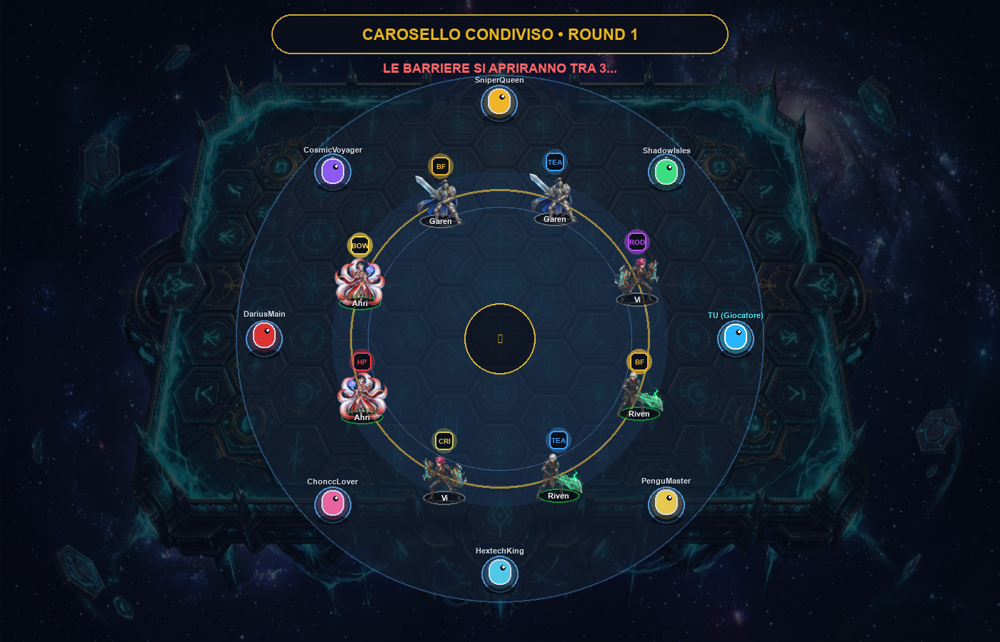
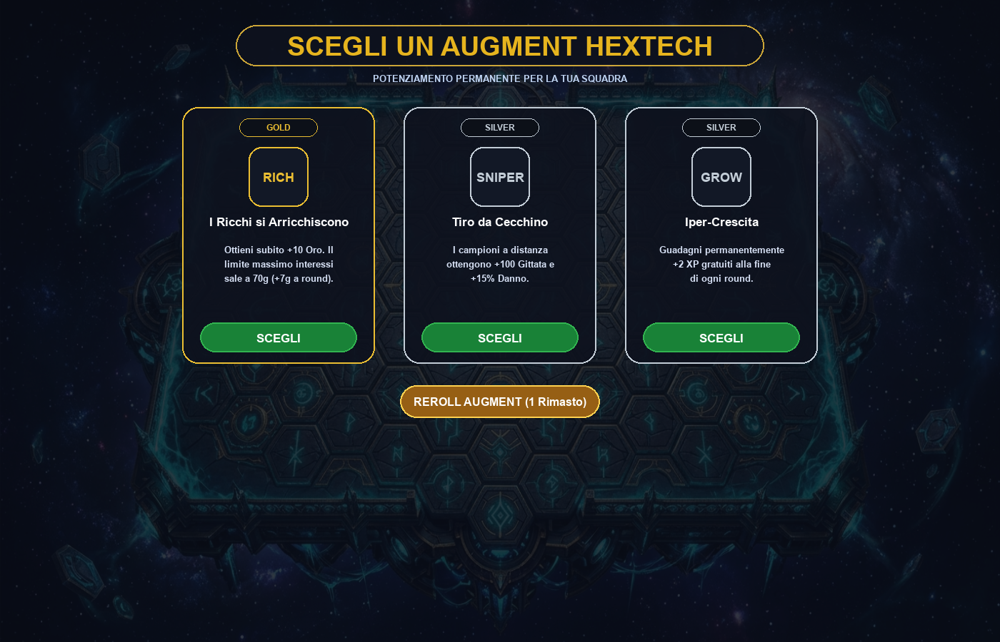
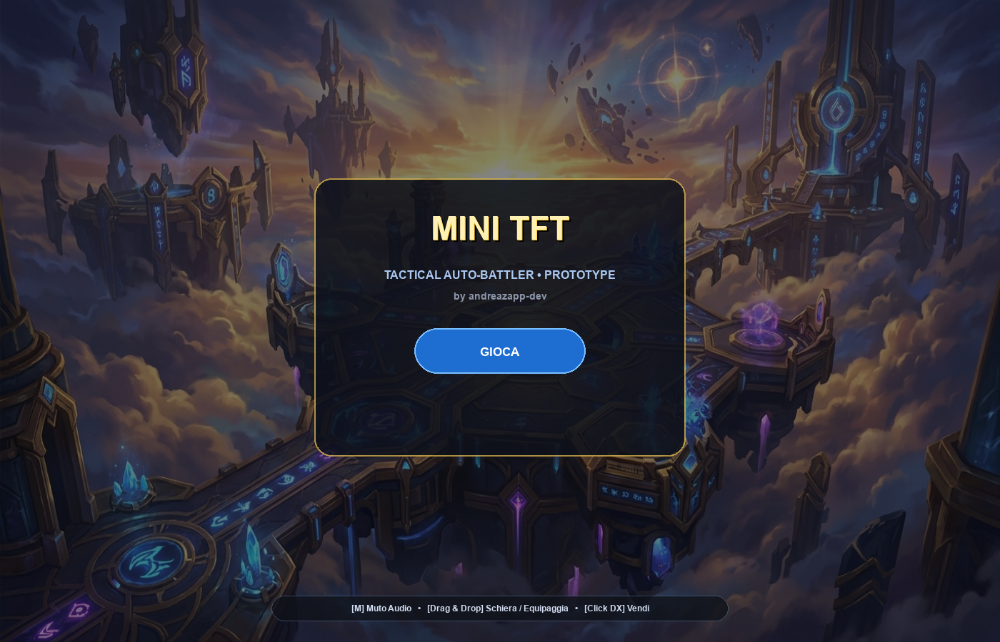

# TFT Python Prototype (Mini-TFT)

A standalone, fully modular 2D Auto-Battler engine written in Python and Pygame, inspired by Riot Games' Teamfight Tactics. This project explores the core systems behind strategy auto-battlers: discrete board mathematics, economy loops, real-time combat simulation, procedural animations, and multi-agent lobby matchmaking.

---

<p align="center">
  
  &nbsp;
  
</p>
<p align="center">
  
  &nbsp;
  
</p>
<p align="center">
  
</p>

---

## Architectural Highlights

The engine is decoupled into specialized subsystems communicating through a central Game Controller finite state machine (`MAIN_MENU`, `CAROUSEL`, `SHOP`, `AUGMENT_SELECTION`, `BATTLE`, `RESULT`).

```
[ Game Controller / State Machine ]
  ├── [ CarouselManager ] ───── 360° Orbital Draft Arena, HP-Tier Comeback Barriers & AI
  ├── [ LobbyManager ] ──────── 8-Player Battle Royale Matchmaking & Bot Simulations
  ├── [ ShopManager ] ───────── Tier Probabilities, Reroll, Dynamic Board/Bench Grid
  ├── [ Traits & Items ] ────── Synergies Evaluator, Compound Item Fusion, Augments
  ├── [ BattleManager ] ─────── Real-Time Combat Tick (60 FPS), Target Acquisition AI
  └── [ Animation & VFX Engine ] Procedural Bobbing, Melee Lunges, Projectiles, Particles
```

### 1. Shared Carousel Draft Phase (`carousel.py`)
- **Orbital Draft Ring:** 8 champions rotate in an orbital circle at 60 FPS carrying floating item components with pulsing aura halos.
- **Comeback Mechanic (HP-Tiered Release):** In Round 1, all players are released simultaneously upon countdown expiry. In subsequent stages (Rounds 4 & 7), players with lower HP pools are released from containment barriers earlier in timed waves, mirroring TFT's comeback balance.
- **Responsive Little Legend & Autonomous Bot Pathing:** Players control their avatar via mouse destination clicking or WASD; 7 bots calculate real-time vector paths toward optimal synergy/item components.
- **Collision & Item Attachment:** Touching a champion claims both the unit and its attached item component, transferring them to the player's bench and inventory.

### 2. 19-Champion Roster & Synergies Matrix (`champions.py`, `traits.py`)
- **Tier 1 (1g):** Garen (*Demacia Cavaliere*), Darius (*Noxus Cavaliere* - *Noxian Guillotine*), Ashe (*Freljord Cecchino* - *Enchanted Crystal Arrow*).
- **Tier 2 (2g):** Ahri (*Ionia Mago*), Vi (*Piltover Picchiatore*), Zed (*Ionia Assassino* - *Death Mark shadow teleport*), Braum (*Freljord Guardiano* - *Glacial Shield*).
- **Tier 3 (3g):** Ezreal (*Piltover Cecchino*), Jinx (*Zaun Cecchino*), Riven (*Noxus Duellante*), Katarina (*Noxus Assassino* - *Death Lotus*), Yasuo (*Ionia Duellante* - *Steel Tempest Tornado*).
- **Tier 4 (4g):** Shen (*Ionia Ninja*), Kayle (*Demacia Divino*), Lux (*Demacia Mago* - *Final Spark full-board laser*), Sejuani (*Freljord Cavaliere* - *Glacial Prison AoE freeze*).
- **Tier 5 (5g):** Aurelion Sol (*Drago Mago* - *Cosmic Meteor Storm*), Azir (*Shurima Mago* - *Emperor's Divide sand soldiers*), Thresh (*Shadow Isles Guardiano* - *Death Sentence chain hook*).
- **Synergy Multipliers:** Sinergie complete con breakpoint modulari (Assassino crit/jump, Guardiano shield aura, Noxus HP/AD conquest stacks, Freljord resist shred, Shurima solar regeneration, Shadow Isles spectral barrier).

### 3. Real-Time Combat Simulation & AI (`battle.py`, `champions.py`)
- **Target Selection & Pathing:** Discrete euclidean distance calculation with real-time dynamic target re-acquisition upon unit death.
- **Mana & Spell Cycle:** Units generate mana on attack and damage taken; at max mana, basic attacks are superseded by special ability routines (e.g., Lux screen-wide rainbow laser, Garen 360° blade storm, Darius decapitation strike, Yasuo whirlwind, Azir sand legion, Thresh spectral hook).
- **Damage Pipeline:** Differentiates physical and magic damage, calculates critical strikes, armor/magic mitigation, and life-steal healing.
- **DPS & Combat Tracker (`damage_meter.py`):** Real-time multi-tabbed meter tracking physical/magic damage output, damage taken, and healing done per unit with proportional comparative graphs.

### 3. 8-Player Battle Royale Lobby (`lobby.py`)
- Manages an 8-player lobby consisting of the local player and 7 autonomous bots with realistic health pools, team compositions, and win/loss streak tracking.
- Concurrent background round simulations evaluate bot-vs-bot matchups, computing player damage dynamically based on remaining unit counts and tier levels.
- Live leaderboard HUD with health bars, player placement rankings (#1 to #8), and scouting tooltips.

### 4. Hextech Augment Engine (`augments.py`)
- 16 distinct augment cards categorized into Silver, Gold, and Prismatic tiers.
- Integrated draft phases at rounds 2, 5, and 8 featuring a 3-card selection modal with a 1-time reroll mechanic per game.
- Deep gameplay modifiers: economy scaling (interest cap raised to 70g), reroll discounts (Golden Ticket 45% free rolls), global vampirism, spell critical strikes, and trait emblems (+1 Demacia, +1 Piltover, +1 Ionia).

### 5. Economy, Bench & Star-Up Systems (`shop.py`, `items.py`)
- **Level-Based Rolling Probabilities:** Dynamic shop odds based on player level (1-cost up to 5-cost legendaries).
- **Interest & Streak Gold:** Standard 10% compound interest (capped at 5g/round or 7g with specific augments) plus win/loss streak bonuses.
- **3-Star Merge Logic:** Automatic 3-copy combination system that promotes units from 1-star to 2-star and 3-star, preserving items, triggering automatic component combinations, and returning overflow items back to the player inventory.

### 6. 2D Character Animation & Procedural VFX (`battle_animations.py`, `asset_loader.py`)
- **Sprite Rendering:** Alpha-masked 2D character sprites with directional horizontal flipping, ground shadows, and team aura indicators.
- **Locomotion:** Smooth trigonometric bobbing and forward tilt during walk cycles, with procedural footstep dust particles.
- **Impact Feedback:** White hit-flash shaders on impact, directional micro-knockbacks, and particle dissipation on unit defeat.
- **Ballistics & VFX:** Trajectory-guided ballistic projectiles (missiles, mystic bolts, magic orbs) with particle trail systems, shockwaves, and melee slash arcs.

---

## Repository Structure

```
├── game.py                 # Main entry point & State Machine Orchestrator
├── carousel.py             # Shared Carousel Draft Phase, orbital physics & Little Legend
├── config.py               # Resolution (1400x900), color palettes, font loaders
├── champions.py            # Champion classes, base attributes, combat stats & abilities
├── traits.py               # Sinergies system, thresholds, buff calculations & HUD
├── items.py                # Item recipes, combination logic & stat buffs
├── augments.py             # Hextech augment database, draft UI & trait bonuses
├── lobby.py                # 8-player lobby state, matchmaking & background bot sims
├── battle.py               # Combat manager, 60 FPS update tick & hit resolution
├── battle_animations.py    # Particle system, projectiles, slash VFX & shockwaves
├── damage_meter.py         # Real-time DPS & damage tracker interface
├── shop.py                 # Shop UI, bench/board drag logic & economy management
├── asset_loader.py         # Image caching, sprite transparency masking & glassmorphism
├── audio_manager.py        # Sound synthesizer and playback manager
└── assets/                 # Character sprites, backgrounds, and showcase screenshots
```

---

## Installation & Execution

### Prerequisites
- Python 3.10+
- Pygame
- Pillow (PIL)

### Setup
```bash
# Clone the repository
git clone https://github.com/andreazappy-dev/TFT-Python-Prototype.git
cd TFT-Python-Prototype

# Install dependencies
pip install pygame pillow

# Run the game
python game.py
```

### Controls
- **Left Mouse Click:** Purchase champions, place/move units between Bench and Board, select Augments, toggle DPS tabs, reroll and level up.
- **[TAB]:** Toggle the live Damage Meter panel.
- **Drag & Drop:** Move items from the item bench directly onto deployed champions to equip or combine them.

---

## License & Credits
Built as an educational research prototype exploring game engine architecture, AI combat simulation, and auto-battler mechanics. All champion designs and art assets are stylized custom renders created for this prototype.